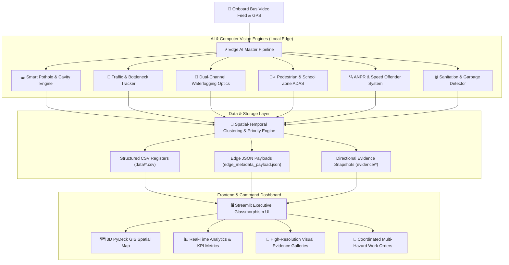

# 🏙️ Urban Intelligence & Transit ADAS — Technical Architecture Report
**Project ID:** SIH26124 / Urban Innovators  
**Application Type:** Edge AI-Powered Urban Monitoring & Transit Intelligence Dashboard  
**Deployment Target:** Public Transit Fleets (UPSRTC / BMTC / DTC) & Central Command HQ  

---

## 🏗️ 1. High-Level Architecture Overview

The system operates as an **Edge-First AI & Multi-Hazard Urban Telemetry Platform**. Video feeds and GPS telemetry captured from onboard bus cameras are processed in real-time or batch mode by edge-compute units, generating categorized municipal incident registries without relying on external paid APIs or continuous cloud connectivity.



---

## 🎨 2. Frontend Technologies (Client-Side & UI/UX)

The user interface is engineered as an **Executive Urban Intelligence Command Center** with state-of-the-art dark glassmorphic aesthetics.

| Component | Technology / Library | Purpose & Implementation Details |
| :--- | :--- | :--- |
| **Core Framework** | **Streamlit (v1.35.0+)** | Reactive, component-based dashboard rendering, multi-page sidebar navigation, interactive controls, and reactive state management. |
| **Styling & Theme** | **Custom Vanilla CSS3 (Embedded)** | Glassmorphism (`backdrop-filter: blur(16px)`), custom glowing gradients, rounded telemetry cards, responsive flexbox layout, and custom scrollbars. |
| **Color System** | **Curated Slate / Cyber Azure Dark Palette** | Background: `#070a13`, Surface Cards: `rgba(15, 23, 42, 0.75)`, Accent Colors: `#38bdf8` (Cyan), `#ef4444` (Danger/Critical), `#10b981` (Normal/Safe). |
| **Typography** | **Google Web Fonts** | Modern dual typography: `Plus Jakarta Sans` (for executive headers & labels) and `JetBrains Mono` (for GPS coordinates, telemetry, and numerical data). |
| **3D Geospatial GIS** | **PyDeck (Deck.gl v0.8.0+)** | Interactive hardware-accelerated 3D WebGL maps (`ScatterplotLayer`, `PathLayer`, `HexagonLayer`) without requiring Mapbox or Google Maps paid tokens. |
| **Interactive Charts** | **Pandas / Streamlit Native Charts** | Real-time traffic density trends, multi-hazard severity distribution bar charts, and timeline charts. |
| **Media & Galleries** | **Pillow (PIL) & Streamlit Media** | Responsive multi-column evidence grids displaying bounding-box annotated frames with metadata HUD banners. |
| **Data Export** | **CSV / UTF-8 Download Handlers** | One-click instant CSV exports for all municipal department registers (PWD, Traffic Police, Municipal Jal Sansthan, Swachh Bharat). |

---

## ⚙️ 3. Backend & Core Computing Layer

The backend executes edge telemetry calculations, file I/O operations, and pipeline orchestration entirely in Python.

| Component | Technology | Purpose & Implementation Details |
| :--- | :--- | :--- |
| **Programming Language** | **Python 3.10 – 3.14** | Primary backend language for concurrency, AI inferencing, and telemetry aggregation. |
| **Data Processing** | **Pandas (v2.0+)** | In-memory filtering, data transformation, corridor segmentation, rolling windows, and multi-sensor registry compilation. |
| **Numerical Computing** | **NumPy (v1.24+)** | Coordinate transformations, array slicing for video frames, statistical thresholding, and metric computations. |
| **Filesystem Architecture**| **`pathlib.Path`** | Fully cross-platform path handling ensuring compatibility across Windows, Linux (Ubuntu/Debian), and macOS. |
| **Server Configuration**| **`.streamlit/config.toml`** | Headless cloud runtime flags (`headless = true`), CORS/XSRF configuration, 500MB upload limit, and dark theme variables. |
| **Environment Tooling**| **`tools/fix_portable_venv.py`** | Custom dynamic virtual environment re-linker for zero-friction portability across host development machines. |

---

## 🧠 4. Artificial Intelligence & Computer Vision Layer

The AI pipeline is modular, comprising specialized detectors coordinated by `master_pipeline.py`.

```
SIH26124_Urban_Intelligence/
└── ai_engine/
    ├── master_pipeline.py           # Master Multi-Sensor Coordinator
    ├── smart_pothole_detector.py    # Surface Cavity & Depth Estimator
    ├── vehicle_detector.py          # Traffic Density & Bottleneck Tracker
    ├── waterlogging_detector.py     # LAB + HSV Dual-Channel Flood Optics
    ├── pedestrian_detector.py       # Pedestrian & School Zone ADAS
    ├── anpr_detector.py             # Corridor-Aware ANPR & Speed Offender System
    └── incident_generator.py        # Spatial-Temporal Clustering & Priority Engine
```

### Module Breakdown:

### 1. 🚗 Vehicle Detection & Traffic Bottlenecks (`vehicle_detector.py`)
- **Core Model:** YOLOv8 Nano (`yolov8n.pt`).
- **Tracking Algorithm:** ByteTrack multi-object tracking (`tracker="bytetrack.yaml"`).
- **Classification:** Cars, Bikes, Buses, and Heavy Commercial Vehicles (Trucks).
- **Analytics:** Dynamic bottleneck choke-point detection based on vehicle count density and speed decay ratios.

### 2. 🕳️ Smart Pothole & Road Cavity Engine (`smart_pothole_detector.py`)
- **Technology:** OpenCV Morphological Blackhat Transform & Surface Depression Contouring.
- **Severity Classification:** Estimates depression depth (`cm`) and surface area (`px`), filtering out smooth asphalt patches and surface shadows.
- **Output:** Categorized into `MEDIUM`, `HIGH`, or `CRITICAL` with direct work-order attribution to PWD / NHAI.

### 3. 🌊 Dual-Channel Waterlogging Optics (`waterlogging_detector.py`)
- **Color-Space Optics:** Dual-channel **LAB** (stagnant dark water pooling) + **HSV** (specular glint and wet asphalt sheen).
- **False-Positive Suppression:** Sobel horizontal gradient filters to reject painted white lane stripes and dry asphalt glare.
- **Output:** Surface water coverage ratio (`%`), individual puddle counters, and flood risk categorization (`LOW` to `CRITICAL`).

### 4. 🚶‍♂️ Pedestrian Safety & School Zone ADAS (`pedestrian_detector.py`)
- **Core Model:** YOLOv8 Person detection class (`cls == 0`).
- **Safety Heuristics:** Identifies high-risk pedestrian crossing situations and triggers priority ADAS audio/visual alerts when pedestrians or school children cross active transit paths.

### 5. 🔍 ANPR & Offender Tracking (`anpr_detector.py`)
- **License Plate Localization:** Edge contour aspect-ratio localization on vehicle bounding boxes.
- **Corridor Awareness:** Geographic state prefixes (e.g., `UP-53` for Gorakhpur, `KA-04` for Bengaluru, `DL-01` for Delhi, `MH-02` for Mumbai).
- **Violation Logic:** Urban speed limit thresholds (>48 km/h or >32 km/h in school zones) queueing central traffic police e-challans.

### 6. 📍 Spatial-Temporal Clustering & Multi-Hazard Dispatch (`incident_generator.py`)
- **Spatial Algorithm:** Haversine distance matrix grouping incidents within an **85-meter GPS radius**.
- **Coordinated Escalation:** When multiple hazards (e.g., severe potholes + waterlogging + traffic choke) occur within the same cluster, the system escalates the cluster to **Priority 98-100 CRITICAL**, triggering unified inter-departmental dispatch.

---

## 💾 5. Data & Storage Layer

| Storage Medium | Format | Location | Purpose |
| :--- | :--- | :--- | :--- |
| **Incident Database** | CSV | `data/incidents.csv` | Central compiled registry of all detected urban defects with GPS, severity, timestamps, and work orders. |
| **Sensor Registries** | CSV | `data/*_results.csv` | Granular sensor logs for ANPR, Traffic, Potholes, Waterlogging, Pedestrians, Sanitation, and Signal faults. |
| **Evidence Repository**| JPEG (`.jpg`) | `evidence/` | High-definition annotated frames saved with metadata HUD overlays (GPS, Speed, Bus ID, Direction, Timestamp). |
| **Central Sync Payload**| JSON | `edge_metadata_payload.json` | Standardized REST-ready JSON payloads for telemetry push to Smart City Integrated Command and Control Centers (ICCC). |

---

## 🚀 6. Deployment & Infrastructure

| Environment | Configuration Details |
| :--- | :--- |
| **Operating System** | Platform-independent: Windows 11 / Linux (Debian 12 / Ubuntu 22.04 LTS). |
| **Container / Cloud** | **Streamlit Community Cloud** with headless container optimization. |
| **System Dependencies** | Specified in `packages.txt`: `libgl1` (OpenGL for headless OpenCV), `libglib2.0-0`, and `ffmpeg` (video decoding). |
| **Python Dependencies** | Managed via `requirements.txt` and `uv` high-speed package resolver. |
| **Zero External API Cost** | **Zero Google Maps API, Zero OpenAI/Gemini API, Zero Mapbox tokens required.** 100% free, private, and offline-capable edge computing. |

---

## 📊 Summary of Tech Stack

```
Frontend:    Streamlit • Custom CSS3 Glassmorphism • Google Fonts (Plus Jakarta Sans, JetBrains Mono)
Geospatial:  PyDeck (WebGL 3D Deck.gl) • Carto Open Vector Tiles
AI / CV:     YOLOv8 Nano (Ultralytics) • OpenCV (cv2) • ByteTrack • Dual LAB+HSV Optics
Backend:     Python 3.14 • Pandas • NumPy • Pathlib
Database:    Local CSV Edge Registries • Telemetry JSON Schema
Deployment:  Streamlit Cloud / Docker • Debian Linux • FFmpeg • libGL1
```
